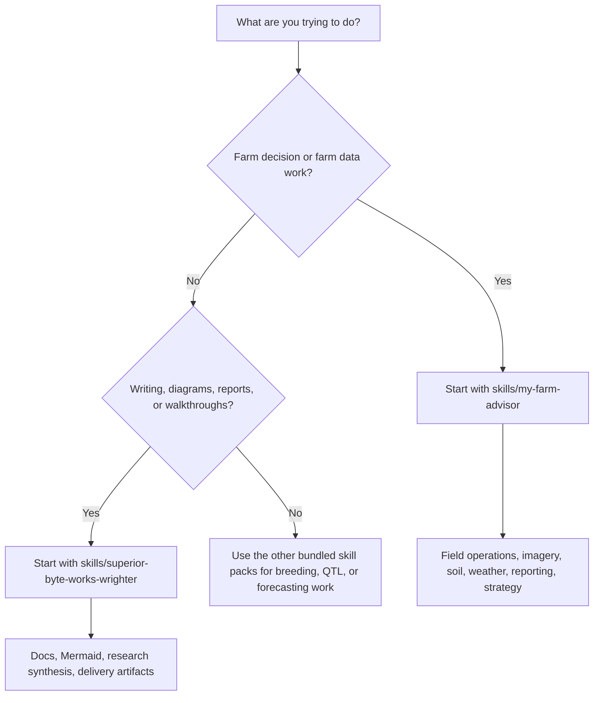

# My Farm Advisor


My Farm Advisor is a farm intelligence and research assistant built on upstream OpenClaw and shaped by the farm-science principles in `SOUL.md` and the operator needs in `USER.md`.

We use `advisor` deliberately. In this project the system is an authoritative, evidence-based component grounded in science, reproducible methods, and validated skills; it is not casual hearsay or a friendly guess. `Advisor` fits the formal system role we want the product to play.

It is designed for farmhands, supervisors, owners, researchers, and ag analysts who need practical field decisions, reproducible analysis, and infrastructure they can actually keep running—at any scale, from one field to infinite fields.

- Evidence-first recommendations instead of dashboard theater
- Field-level data lineage so results can be traced back to methods and inputs
- Docker-first deployment so RAM and compute can scale beyond Cloudflare Worker limits
- Scalable storage: local, S3, R2, or any S3-compatible object storage for infinite field capacity
- Multi-agent architecture: starts with two agents (field operations + data pipeline), scales to unlimited custom agents
- Upstream OpenClaw compatibility for easier updates and broader channel/tool support

## What This Repo Is

This repository tracks real upstream OpenClaw as its runtime base.

- Core runtime, gateway, Docker flow, and channel support come from `openclaw/openclaw`
- Farm-specific behavior lives in `SOUL.md`, `USER.md`, and retained custom skills in `skills/`

## Who It Is For

My Farm Advisor assumes multiple roles may use the same system:

- Farmhands who need simple instructions for one field today
- Supervisors who need fast rollups across active fields
- Owners and managers who care about profit per acre, risk, and timing
- Researchers who need reproducible methods, versioned data, and audit trails
- Analysts who need outputs that can be checked against real farm data

The guiding rule is simple: one field-level source of truth, many ways to summarize it.

## Agents

My Farm Advisor runs two personas that share the same soul, user, and tool context:

- **Field Operations Agent** (`IDENTITY.md`, workspace `/data/workspace`) — focuses on day-of field work, scouting, and application plans.
- **Data Pipeline Agent** (`IDENTITY.data-pipeline.md`, workspace `/data/workspace-data-pipeline`) — maintains ingestion jobs, validations, and lineage so every recommendation remains reproducible.

Both agents follow the evidence-first, test-before-scaling practices defined in `SOUL.md` and coordinate via the shared `AGENTS.md` guide.

## Farm Skills Included

The active custom layer currently keeps these skills:

- [`skills/my-farm-advisor/`](skills/my-farm-advisor/README.md)
- `skills/my-farm-breeding-trial-management/`
- `skills/my-farm-qtl-analysis/`
- `skills/superior-byte-works-google-timesfm-forecasting/`
- [`skills/superior-byte-works-wrighter/`](skills/superior-byte-works-wrighter/README.md)

These sit on top of the upstream OpenClaw skill system rather than replacing it.

### Highlighted Skill Packs

- [`skills/my-farm-advisor/README.md`](skills/my-farm-advisor/README.md) is the main farm umbrella skill. It routes requests into field management, imagery, soil, weather, strategy, data rebuilds, reporting, and admin workflows so the system can act like a real farm advisor instead of a generic chat assistant.
- [`skills/superior-byte-works-wrighter/README.md`](skills/superior-byte-works-wrighter/README.md) is the structured writing and documentation engine for the repo. It explains how we produce docs, reports, Mermaid diagrams, research syntheses, and delivery-ready artifacts through a text-first workflow.

Together, those two skill packs cover the project's two most important custom layers:

- farm intelligence and field-level decision support
- writing, reporting, and explanation of how the system works

### Which Skill Should I Start With?



As a rule of thumb:

- start with `my-farm-advisor` when the question is about fields, crops, weather, soil, imagery, or farm operations
- start with `superior-byte-works-wrighter` when the task is to explain, document, diagram, package, or publish something clearly

## Core Principles

Derived from `SOUL.md` and `USER.md`:

- Prefer measurable outcomes over rhetoric
- Preserve data, methods, and provenance so work stays reproducible
- Keep interfaces direct and practical for busy operators
- Do not silently destroy or overwrite important farm history
- Favor portable, inspectable tooling over vendor lock-in

## Deployment

### Docker-first (recommended)

Works anywhere you can run Docker: local machine, VPS, cloud provider. No lock-in.

```bash
cp .env.example .env
# Add your API keys (see below)
pnpm install
pnpm build

# Build the local image, onboard through the compose-managed CLI, then fetch the dashboard URL
docker build -t openclaw:local -f Dockerfile .
docker compose run --rm openclaw-cli onboard --mode local --no-install-daemon
docker compose run --rm openclaw-cli dashboard --no-open
```

`openclaw-cli` shares `openclaw-gateway`'s network namespace, so `docker compose run --rm openclaw-cli ...`
starts or reuses the gateway service automatically. Use `openclaw-cli` for follow-up Docker commands;
if you stop the stack later, bring the long-running gateway back with `docker compose up -d openclaw-gateway`.

### Coolify (one-click)

Point Coolify at our `docker-compose.coolify.yml`. That is the validated deployment entrypoint.
That compose file builds and tags `${OPENCLAW_IMAGE:-openclaw:local}` for
`openclaw-gateway` and reuses the same tag for `openclaw-cli`.
On first boot, allow several minutes for initialization before health checks settle.
The `openclaw-cli` service is profile-gated (`cli`) so Coolify deploys only the
gateway by default.
For the supported Cloudflare Zero Trust deployment, see
[`docs/install/cloudflare-coolify.md`](docs/install/cloudflare-coolify.md).
That runbook is the canonical Zero Trust contract: one Coolify compose app,
same-compose `cloudflared`, `CLOUDFLARE_TUNNEL_TOKEN` plus
`OPENCLAW_PUBLIC_HOSTNAME`, Cloudflare Access as the only public login layer,
the root dashboard/admin entry at `https://<OPENCLAW_PUBLIC_HOSTNAME>`, exact
trusted-proxy origin/IP allowlists, the optional secondary pinned hostname
pattern, and the final step of turning off any temporary direct public `http://`
path after Cloudflare is live.

For the real-world operator order that was actually walked through, see
[`docs/install/cloudflare-coolify-walkthrough.md`](docs/install/cloudflare-coolify-walkthrough.md).
That walkthrough captures the practical sequence that worked in production-like
testing: secure Coolify itself first, create the Cloudflare tunnel and Access
policy, add the GitHub source/project/resource in Coolify, use
`docker-compose.coolify.yml`, paste env vars in Coolify, watch live logs, then
remove any direct public Coolify or raw-IP path once the protected hostname is healthy.

Practical Zero Trust rules for this deployment:

- Keep the gateway private on `127.0.0.1:18789`; do not normalize raw-IP access.
- Treat Cloudflare Tunnel as the only public ingress path.
- Treat Cloudflare Access as the only public admin login path.
- After any env-var change in Coolify, save and redeploy so the runtime actually picks it up.

For the supported farm Telegram setup, keep the roles split cleanly:

- The root dashboard/admin path stays on the web surface only and does not own a Telegram bot.
- `field-operations` is the default Telegram account and is the farm's main Telegram entry point.
- `data-pipeline` is a separate named Telegram account and must be routed with an explicit `bindings[].match.accountId` binding.
- Leave `TELEGRAM_BOT_TOKEN` unset or blank in the supported farm deployment path. It is only a legacy fallback for the default Telegram account.
- Channel-only Telegram bindings with no `accountId` match the default account only, so they cover `field-operations` and not `data-pipeline`.

### Local development

```bash
pnpm install
pnpm build
pnpm openclaw onboard --install-daemon
pnpm gateway:watch
```

## API Keys (inexpensive/free)

Pre-configured to work with free/cheap options:

- **NVIDIA NIM**: Free developer tier available at build.nvidia.com
- **OpenRouter**: Access to free and very cheap models. Sign up at openrouter.ai

Add these to `.env`:

```
NVIDIA_API_KEY=your_nvidia_key_here
OPENROUTER_API_KEY=your_openrouter_key_here
```

Running costs should be minimal—often zero with free tiers.

## Setup Notes

- Workspace config lives in `~/.openclaw`
- Workspace skills live in `~/.openclaw/workspace/skills`
- This repo also ships bundled farm skills in `skills/`
- `SOUL.md` and `USER.md` provide the farm-specific identity layer for this distribution
- `scripts/fresh-local-bootstrap.sh` stops the stack, clears the bootstrapped workspaces (keeping `data/` and `.venv`), removes `openclaw.json`, then rebuilds with `docker compose up -d --build` for a clean resync.
- The supported farm Telegram layout is a 3-role model: web-only dashboard/admin root, default Telegram account `field-operations`, and named Telegram account `data-pipeline`.
- When you know the numeric Telegram user IDs that should reach the bots, set `TELEGRAM_ALLOWED_USERS` (or the per-account overrides) in `.env`; the entrypoint will switch DM access to an allowlist so OpenClaw stops issuing one-time pairing codes after approval ([docs.openclaw.ai/channels/telegram](https://docs.openclaw.ai/channels/telegram)).

## Upstream Relationship

My Farm Advisor tracks upstream OpenClaw closely so the project can keep benefiting from:

- active runtime maintenance
- broader channel support
- upstream Docker improvements
- new tools, skills, and platform integrations

When changing core runtime behavior, prefer upstream-compatible changes whenever possible.

## Helpful Docs

- OpenClaw getting started: `https://docs.openclaw.ai/start/getting-started`
- OpenClaw Docker install: `https://docs.openclaw.ai/install/docker`
- OpenClaw skills docs: `https://docs.openclaw.ai/tools/skills`
- OpenClaw gateway config: `https://docs.openclaw.ai/gateway/configuration`

## Brand Notes

- Product name: My Farm Advisor
- Runtime/CLI base: OpenClaw
- Use `advisor` for the system component and all project-facing naming.
- Historical paths may still use `my-farm-advisor` for compatibility, but internal branding should use `Advisor`.
